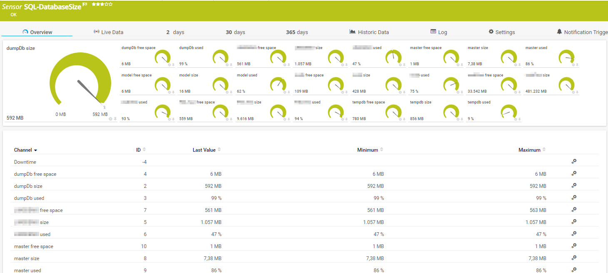

# PRTG-SQL-DatabaseSize
# About

## Project Owner:

Jannos-443

## Project Details

Checks SQL Database Size, Space Available and used Space for every database!

| Parameter | Default Value |
| --- | --- |
| Size | $true |
| UsedSpace | $true |
| FreeSpace | $true |

## HOW TO

1. Make sure the SQLServer Module exists on the Probe
   - `https://docs.microsoft.com/en-us/sql/powershell/download-sql-server-ps-module?view=sql-server-ver15`

2. Place `PRTG-SQL-DatabaseSize.ps1` under `C:\Program Files (x86)\PRTG Network Monitor\Custom Sensors\EXEXML`

3. Create new Sensor

   | Settings | Value |
   | --- | --- |
   | EXE/Script | PRTG-SQL-DatabaseSize.ps1 |
   | Parameters | `-sqlInstanz "SQL-Test" -IgnorePattern '(SQL-ABC)'` |
   | Scanning Interval | 10 minutes |


4. Set the "$IgnorePattern" or "$IgnoreScript" parameter to exclude databases

5. Set "$Size", "$UsedSpace" or "$FreeSpace" to false and use multiple sensors in big environments.


## Examples


exceptions
------------------
You can either use the **parameter $IgnorePattern** to exclude a database on sensor basis, or set the **variable $IgnoreScript** within the script. Both variables take a regular expression as input to provide maximum flexibility. These regexes are then evaluated againt the **Database Name**

By default, the $IgnoreScript varialbe looks like this:

```powershell
$IgnoreScript = '^(Test-SQL-123|Test-SQL-12345.*)$' 
```

For more information about regular expressions in PowerShell, visit [Microsoft Docs](https://docs.microsoft.com/en-us/powershell/module/microsoft.powershell.core/about/about_regular_expressions).

".+" is one or more charakters
".*" is zero or more charakters
